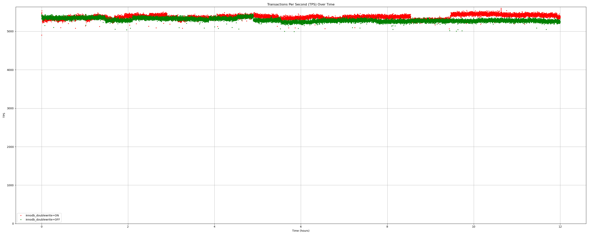

Table of Contents
=================

# Plot sysbench tps output with matplotlib and pandas

This let's you collect sysbench output and then graph it. If you have two
different runs you can collect both output and compare them on the same graph
too. The container mysql:8.0 is used for simplicity.

# Usage

```bash
./0004-run-sysbench.sh | tee -a sysbench_output.txt
```

# Initial setup

Although this tree is just about graphing the TPS, it can be used to also
ramp up a MySQL container and a few others to initialize sysbench tables,
populate them, start sysbench and collect telemetry. That is just optional
scripts you can use for further analysis and is beyond the scope of this
tree, the scripts are just provided for convenience. Proper integration for
automation in full scope will be done later in kdevops.

# Example output of a single run zoomed out

We start plot at 0 on the y axis.


# Example output of a single run zoomed in

We start plot at the first TPS value on the y axis.


# Example output of comparing two runs zoomed out

We start plot at 0 on the y axis.



# Example output of comparing two runs zoomed in

We start plot at the first TPS value on the y axis.


## Plotting TPS


You can compare TPS against two workloads:

```bash
./compare-sysbench.py tps-ext4-bigalloc-16k-24-tables-512-threads-v2.txt tps-xfs-16k-reflink.txt --legend1 "ext4 bigalloc 16k" --legend2 "xfs 16k reflink"
```

## Visualizing TPS variance

Standard deviation tells us how far off from the mean a random TPS sample
can be. However it is not easy to tell from this the scale out outliers.
Variance is defined as the square of the standard deviation, this makes
variance more sensitive to larger deviations. A few extremely high or
low TPS values will significantly increase the variance.

Even though variance is defined by the standard deviation it is also helpful
to quantify and visualize variance. We provide plots to get a better sense
of TPS standard deviation, and separately the variance. The lower the variance
the more stable your TPS.

```bash
./plot-variance-tps.py \
    tps-xfs-reflink.txt "xfs 16k innodb_doublewrite=off" \
    tps-xfs-reflink-doublewrite.txt "xfs 16k innodb_doublewrite=ON"
```

# Preconditioning

There are two parts to pre-conditioning:

  * pre-fill the drive
  * steady state detection

You may just want to change the minutes for hours.  Note that if you use
runtime=6h and ss_dur=4h it means that we can bail early if steady state is
attained before 6 hours. The 6 hours would be the upper bound.

Use:

```bash
# We pre-fill twice
./ss/pre-fill.sh /dev/nvme0n1
./ss/pre-fill.sh /dev/nvme0n1

# First steady state for IOPS
fio --warnings-fatal --output=ss_iops.json --output-format=json+ ss/0001-fio_ss_generic-random-iops.ini

# Second seteady state, now for throughput
fio --warnings-fatal --output=ss_iops.json --output-format=json+ ss/0002-fio_ss_generic-random-bw.ini

# XXX: fio needs latency steady-state
```

## Parsing json output from fio steady state

Let's process the sample file we used which just had a runtime=6m and ss_dur=4m.

```bash
# Install jq
apt-get install jq

# Let's get the steady state job descriptions we defined ourselves

# First the iops steady state results file
jq '.jobs[0].jobname,.jobs[0].steadystate.ss,.jobs[1].jobname,.jobs[1].steadystate.ss' ss/ss_iops.json 
"steady-state-mean-iops"
"iops:20.000000%"
"steady-state-slope-iops"
"iops_slope:10.000000%"

# Second the throughput steady state results file
jq '.jobs[0].jobname,.jobs[0].steadystate.ss,.jobs[1].jobname,.jobs[1].steadystate.ss' ss/ss_bw.json 
"steady-state-mean-bw"
"bw:20.000000%"
"steady-state-slope-bw"
"bw_slope:10.000000%"

# Now see if we attained steady state given the formulation and requirements
# we had specified for IOPS.
jq '.jobs[1].steadystate.attained,.jobs[1].steadystate.attained' ss/ss_iops.json
1
1

# How about for throughput
jq '.jobs[1].steadystate.attained,.jobs[1].steadystate.attained' ss/ss_bw.json
1
1

# Count how many entries we collected for IOPS
jq '.jobs[0].steadystate.data.iops,.jobs[0].steadystate.data.bw,.jobs[1].steadystate.data.iops,.jobs[1].steadystate.data.bw | length' ss/ss_iops.json
240
240
240
240

# OK how aobut for throughput
jq '.jobs[0].steadystate.data.iops,.jobs[0].steadystate.data.bw,.jobs[1].steadystate.data.iops,.jobs[1].steadystate.data.bw | length' ss/ss_bw.json
240
240
240
240
```

## json file sizes

For a 6 hour run you can expect each json file to be about 1.5M - 2M.

## Plotting steady state

To plot steady state just run on a directory that has the above json output
files, either both or just one:

```bash
./plot-fio-steady-state.py --title-prefix "DRIVE-1 - 6 Hour Random Write" \
    --iops-max 100000  --bw-max 100.0GB/s
```

## Comparing steady-state of two drives

There are two scripts with different focus on how they can highlight differences
between drives achieved steady state. This is useful to compare results against
two drives, or the same drive with different firmware.

  * compare-ss.py: by default makes it clear that the first drive
    is a different drive by using larger markers, the second drive
    uses the smallest markers. Color hue can be modified as well for
    the second drive, we use some sensible defaults to "off" the coloring
    from the first drive. You can use color drift in values -255 to 255 for
    modify the color drift in RGB for the second drive. You can also modify
    the default marker sizes for each drive.

  * compare-ss-animate.py: creates an animation to show the second drive
    data first, followed by the first drive. The markers are the same size
    so the only change is slightly the coloring as in the last script.
    The differences are more clearly visible by displaying the data from
    the first drive slightly later. This shares the same options as the
    first script. A 6 hour drive steady state json output for both iops and
    bandwidth will make this script output a gif output file of about 7M
    in about less than one minute.

Usage:

```bash
./compare-ss.py \
        --dir1 DRIVE-1/ --dir2 DRIVE-2/ \
        --iops-max 100000 \
        --bw-max 10.0GB/s \
        --title-prefix "DRIVE-1 Vs DRIVE-2- 2TB - 6 Hour Random Write"

./compare-ss-animate.py <same-arguments-as-above>
```

## IU Tools

### blkalgn

One eBPF tools is provided to help evaluate block alignment.

  * blkalgn     -- allows you to see a block device IOs counts and alignment
  * plot-iu.py  -- lets you plot results

#### Dependencies

```bash
apt-get install python3-bpfcc
```

#### Tools sources

  * https://github.com/dagmcr/bcc.git
  * branch:
    * blkalgn

#### Comparing IU workloads on two workloads

```bash
./plot-iu.py ext4.json xfs.json --legend1 ext4 --legend2 xfs
```

#### Running eBPF scripts inside a container

You can run blkalgn inside a container, make sure /opt/root-iu/ is created
and copy the iu-tools/* there. Then just use

```bash
docker run --rm --name blkalgn \
    --volume=/opt/root-iu:/root/ \
    --ulimit=memlock=-1:-1  \
    --privileged  \
    -v /lib/modules:/lib/modules:ro  \
    -v /sys:/sys:ro \
    -v /usr/src:/usr/src:ro  \
    -it debian:testing /bin/bash
```

Inside the container you will then need to do:

```
apt-get update; apt-get install python3-bpfcc
```


License
-------

This work is licensed under the copyleft-next-0.3.1, refer to the [LICENSE](./LICENSE) file
for details. Please stick to SPDX annotations for file license annotations.
If a file has no SPDX annotation the copyleft-next-0.3.1 applies. We keep SPDX annotations
with permissive licenses to ensure upstream projects we embraced under
permissive licenses can benefit from our changes to their respective files.
Likewise GPLv2 files are allowed as copyleft-next-0.3.1 is GPLv2 compatible.
