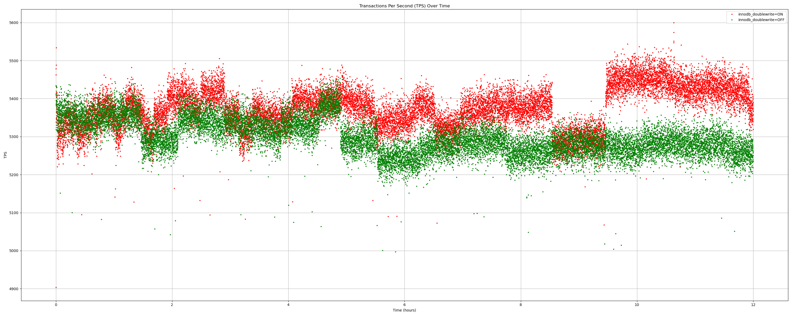

Table of Contents
=================

# Plot sysbench tps output with matplotlib and pandas

This let's you collect sysbench output and then graph it. If you have two
different runs you can collect both output and compare them on the same graph
too. The container mysql:8.0 is used for simplicity.

# Usage

```bash
./0004-run-sysbench.sh | tee -a sysbench_output.txt
```

# Initial setup

Although this tree is just about graphing the TPS, it can be used to also
ramp up a MySQL container and a few others to initialize sysbench tables,
populate them, start sysbench and collect telemetry. That is just optional
scripts you can use for further analysis and is beyond the scope of this
tree, the scripts are just provided for convenience. Proper integration for
automation in full scope will be done later in kdevops.

# Example output of a single run zoomed out

We start plot at 0 on the y axis.


# Example output of a single run zoomed in

We start plot at the first TPS value on the y axis.


# Example output of comparing two runs zoomed out

We start plot at 0 on the y axis.


# Example output of comparing two runs zoomed in

We start plot at the first TPS value on the y axis.



# Preconditioning

There are two parts to pre-conditioning:

  * pre-fill the drive
  * steady state detection

Use:

```bash
# We pre-fill twice
./ss/pre-fill.sh /dev/nvme0n1
./ss/pre-fill.sh /dev/nvme0n1

# First steady state for IOPS
fio --warnings-fatal --output=ss_iops.json --output-format=json+ ss/0001-fio_ss_generic-random-iops.ini

# Second seteady state, now for throughput
fio --warnings-fatal --output=ss_iops.json --output-format=json+ ss/0002-fio_ss_generic-random-bw.ini

# XXX: fio needs latency steady-state
```

You may just want to change the minutes for hours. There's a work in progress
plot of the steady state output files there. Note that if you use runtime=6h
and ss_dur=4h it means that we can bail early if steady state is attained
before 6 hours. The 6 hours would be the upper bound.

License
-------

This work is licensed under the copyleft-next-0.3.1, refer to the [LICENSE](./LICENSE) file
for details. Please stick to SPDX annotations for file license annotations.
If a file has no SPDX annotation the copyleft-next-0.3.1 applies. We keep SPDX annotations
with permissive licenses to ensure upstream projects we embraced under
permissive licenses can benefit from our changes to their respective files.
Likewise GPLv2 files are allowed as copyleft-next-0.3.1 is GPLv2 compatible.
